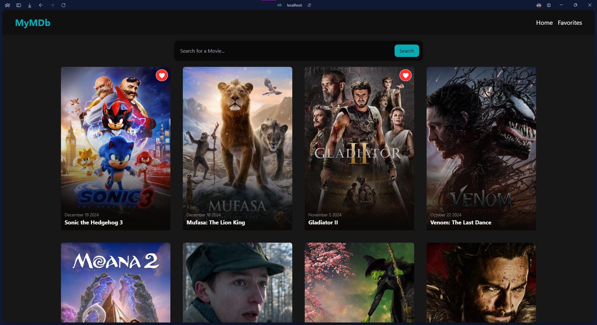
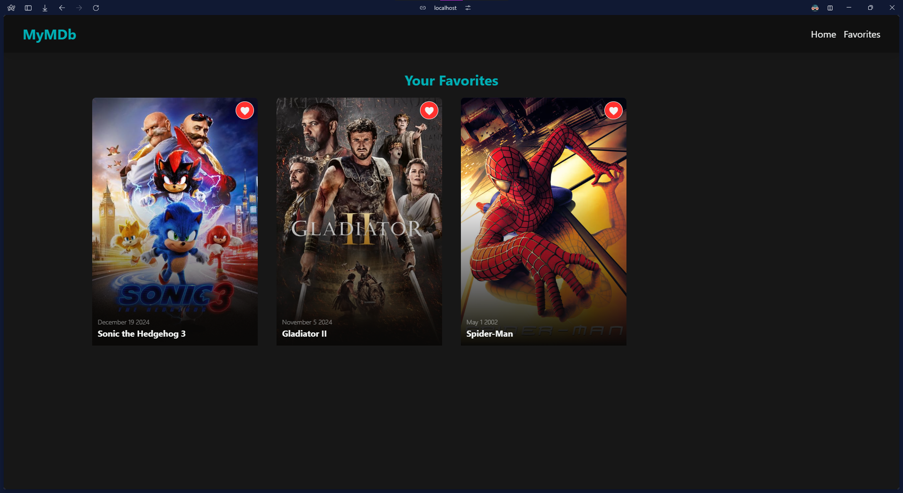
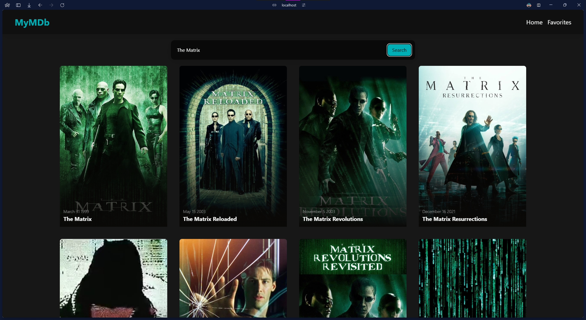

# MyMDb

This is a movie application built using React, TypeScript, and Vite. It allows users to search for movies, view movie details, and add movies to their favorites.

## Prerequisites

Before installing and running the application, ensure you have the following installed and set up first:

- Node.js (version 18 or higher)
- npm package manager (pnpm)
- An API Key from [The Open Movie Database (TMDb) ](https://www.themoviedb.org/documentation/api)

## Getting Started

To run the application locally, follow these steps:

1. Clone the Repository:

  ```bash
  git clone https://github.com/arnie1x/mymbdb.git
  ```

2. Install Dependencies:

  ```bash
  pnpm install 
  ```

3. Create a `.env` Paste your API Key in the root directory of the project. An `env.example` file has been provided as a reference.
```bash
  VITE_THEMOVIEDB_API_KEY=YOUR_API_KEY
```

4. Start the Development Server:

  ```bash
  pnpm run dev
  ```

## Architecture

The application is organized into the following directories:

- **`src`**: Contains the source code for the application.
- **`components`**: Contains reusable UI components.
- **`contexts`**: Contains context providers for managing state.
- **`pages`**: Contains the main pages of the application.
- **`services`**: Contains API services for interacting with the movie database.
- **`styles`**: Contains global styles and component-specific styles.

## Features

- **Search Movies**: Users can search for movies by title and view the results.
- **Add to Favorites**: Users can add movies to their favorites and view their favorites on a separate page.

## Technologies Used

- **React**: A JavaScript library for building user interfaces.
- **TypeScript**: A statically-typed superset of JavaScript that adds type checking and other features.
- **Vite**: A fast development server and build tool for modern web applications.
- **Axios**: A promise-based HTTP client for making API requests.
- **Tailwind CSS**: A utility-first CSS framework for rapidly building custom designs.

## Acknowledgments

The movie database used in this application is provided by [The Open Movie Database (TMDb) ](https://www.themoviedb.org/)

## Screenshots

### Homepage



### Favorites



### Search


